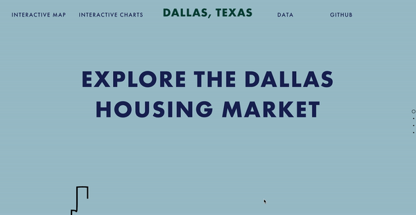
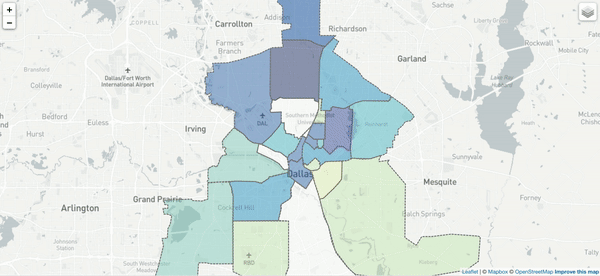

# housing-map

Website that explores [Dallas housing data]("") scraped from Zillow.com. The housing information is combined with the [Dallas neighborhoods GeoJSON]("") to generate a Leaflet map visualized average housing prices by neighborhood. The map also features toggle on/off layers that allows users to explore each house on the market, a crime heat map obtained from [Dallas Open Data Police Incident Reports](""), and grocery store clusters obtained from [Dallas Open Data Grocery Stores List]("").

## Website 
  
The frontpage features an SVG of the Dallas skyline which was converted into an HTML path using Inkscape. The path plays on a loop using the [Vivus React Plugin]('https://maxwellito.github.io/vivus/').

  
Leaflet map created by combining GeoJSON data for Dallas Neighborhoods with geolocation data scraped from Zillow.com listings using Geopandas to generate datasets containing housing data separated by neighborhoods. The layer controls feature enables users to toggle between greyscale and satellite map tiles, or view house markers, the crime heat map, and grocery store markers. 
 

The website is separated into sections and uses a JQuery plugin for the one-page scroll effect [created by Pete R.]("https://github.com/peachananr/onepage-scroll").
## Tools 

* Javascript
    * Vivus (React plugin)
    * Semantic (React plugin)
    * D3 
    * Leaflet 
    * JQuery
    * Plotly

* Python 
    * Pandas
    * GeoPandas
    
## data
[grocery store data](https://www.dallasopendata.com/Services/Dallas-Grocery-Stores/dhyw-s2d5)
[police reports](https://www.dallasopendata.com/Public-Safety/Police-Incidents/qv6i-rri7)